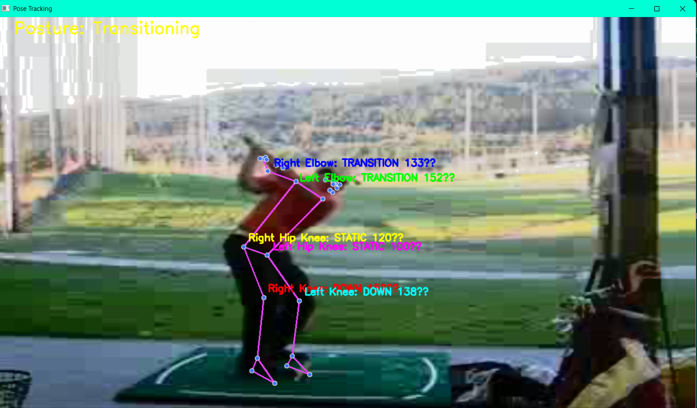
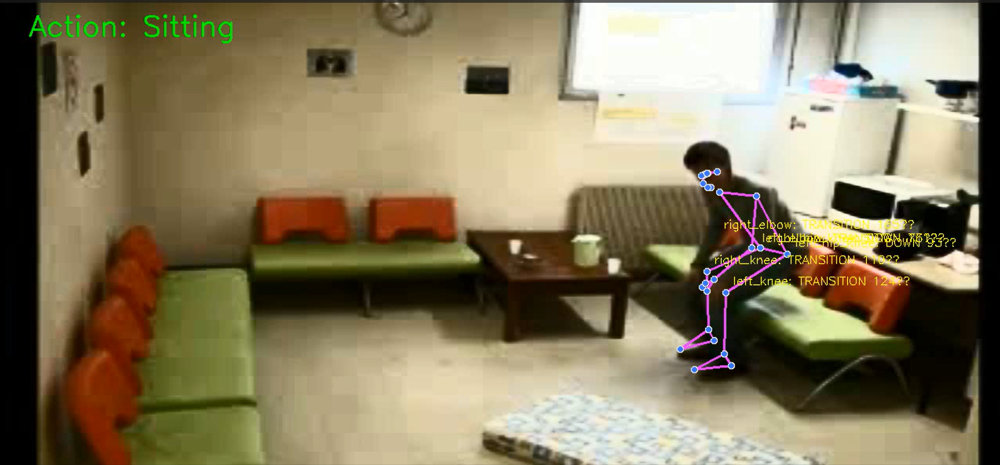

# Human Pose Tracking, Movement Classification & Posture Detection

This project uses **MediaPipe Pose**, **Kalman Filters**, and custom logic to track human joints, smooth movements, calculate joint angles, classify joint movements, and detect overall posture.  
The system can work in **real-time visualization mode** or in **dataset feature extraction mode** for training ML models.
Here is the position tracking visualization for different joints:

Here is the action classification for whole bodt:


---

## Features
- **Pose detection** using MediaPipe
- **Kalman filter smoothing** for each joint
- **Angle calculation** for defined joint triplets
- **Joint movement classification** (`UP`, `DOWN`, `STATIC`, `TRANSITION`)
- **Posture detection** from joint angles
- **Real-time video annotation** with angles and states
- **Feature extraction** for ML model training

---

## Processing Flow

### 1. Video Input
- Reads a video file (e.g., sports actions, exercises).
- Optionally applies preprocessing such as resizing or background subtraction.

### 2. Pose Estimation
- Runs **MediaPipe Pose** to extract 33 body landmarks per frame.
- Converts normalized `(x, y)` to pixel coordinates.

### 3. Kalman Filter Smoothing
- Creates a separate **Kalman filter** for each joint (`joint_0` ... `joint_32`).
- Predicts and updates each joint’s position every frame to reduce noise.
- Stores filtered positions in `joint_history`.

### 4. Angle Calculation
- Uses predefined **joint triplets** from `ANGLE_JOINTS` (e.g., shoulder-elbow-wrist).
- Calculates the angle at the middle joint (`B`) using vector math.
- Stores angles in `angle_history`.

### 5. Movement Classification
- For each joint triplet:
  - Calculates **vertical displacement** (`delta_y`).
  - Calculates **angular velocity** (change in angle between frames).
  - Classifies movement:
    - `UP` – upward motion
    - `DOWN` – downward motion
    - `STATIC` – no significant movement
    - `TRANSITION` – intermediate state
- Saves movement status in `status_history`.

### 6. Posture Detection
- Calls `detect_posture(angle_history)` to determine overall posture category.
- Posture rules are based on recent joint angles.

### 7. Real-time Visualization
- Overlays on video:
  - Joint connections and positions
  - Joint angle & movement state
  - Overall posture
- Displays in a live window with `cv2.imshow()`.
- Writes annotated frames to output video.

---

## Example Output
- Annotated video showing:
  - **Green/Red/Blue** joint connections
  - Text like `"Right Elbow: UP 145°"`
  - `"Posture: Standing"` in top-left

---

## Training Workflow
1. **Feature Extraction Mode**
   - Run on all dataset videos to produce:
     - `X_sequences.npy` → sequence features (joint positions, angles, statuses)
     - `y_labels.npy` → action labels
2. **Model Training**
   - Train your ML model  using extracted features.
3. **Prediction Mode**
   - Use the trained model to classify actions/postures from live or recorded video.

---

## Dependencies
- Python 3.8+
- OpenCV
- MediaPipe
- NumPy
- FilterPy (for Kalman filter)
- tqdm

Install:
```bash
pip install opencv-python mediapipe numpy filterpy tqdm
